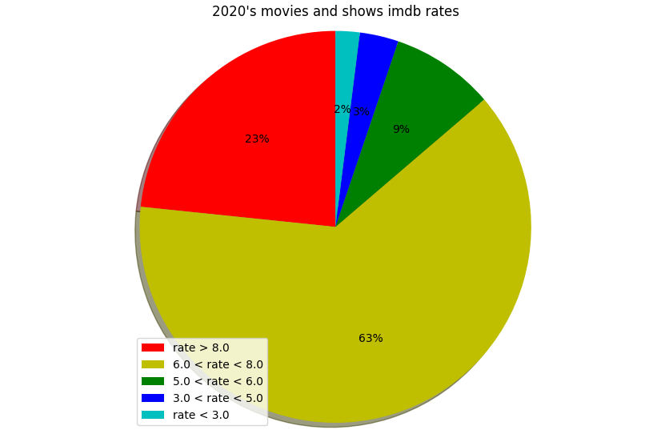

# IMDb informations of all the movies and tv shows released on 2020

In this projects, I've scripted the IMDb rates, movie and tv show names, metascores and votes of all the movies and tv shows of 2020 including those that don't have metascore values. The number of scripted pages was too high, so I only scripted 1000 pages, and each page has 50 movies and TV shows, the total number of scripted movies was 50,000. 

Language used is Python 3.8. / Pycharm.

I've used BeautifulSoup to parse the HTML content.

<h2> Ploting the data
  
### The following plots are created by *Imdb_Data_Analysis.py*
  
  
 
  As we can see here, there are a lot of movies that have a good ratings.
 
 
 
  Same thing for metascore.
 
   
  
  To make it much clearer, i added a bar chart.
  
  
